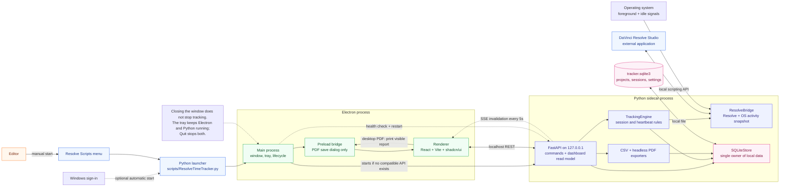
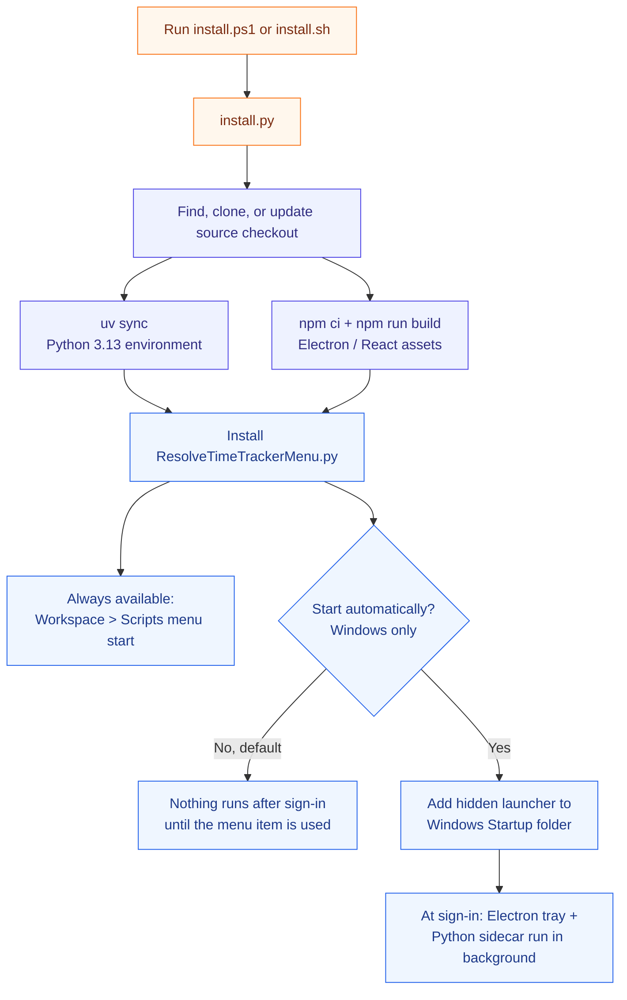

# Resolve Time Tracker

> **Work in progress:** Resolve Time Tracker is working, but it is still evolving. Clone it, fork it, modify it for your own DaVinci Resolve workflow, and open pull requests if you build something useful.

[](https://www.blackmagicdesign.com/products/davinciresolve)
[](https://www.python.org/)
[](https://fastapi.tiangolo.com/)
[](https://www.electronjs.org/)
[](https://react.dev/)
[](https://ui.shadcn.com/)
[](https://www.sqlite.org/)
[](LICENSE)

Resolve Time Tracker is an MIT-licensed, open-source time tracker for DaVinci Resolve Studio. It tracks billable editing time per Resolve project while avoiding the classic mistake: counting time after the editor has walked away.

## Install

Resolve Time Tracker installs as a DaVinci Resolve Scripts-menu tool. After install, open Resolve and run:

```text
Workspace > Scripts > ResolveTimeTrackerMenu
```

| Platform | Download | Run |
| --- | --- | --- |
| Windows | [install.ps1](https://raw.githubusercontent.com/Today20092/Davinci-Resolve-TimeTracker/main/install.ps1) | Right-click the file and choose **Run with PowerShell**. |
| macOS | [install.sh](https://raw.githubusercontent.com/Today20092/Davinci-Resolve-TimeTracker/main/install.sh) | `sh ~/Downloads/install.sh` |
| Linux | [install.sh](https://raw.githubusercontent.com/Today20092/Davinci-Resolve-TimeTracker/main/install.sh) | `sh ~/Downloads/install.sh` |

If Windows blocks `install.ps1`, open PowerShell in your Downloads folder and run:

```powershell
powershell -ExecutionPolicy Bypass -File .\install.ps1
```

The installer downloads the project source, installs Python dependencies, builds the companion app, and adds the DaVinci Resolve menu script.
It asks whether tracking should stay manual or start automatically with your computer. Manual start is the default.

### What "Start automatically" means

This choice currently applies to Windows:

- **Yes:** the installer adds `ResolveTimeTrackerBackground.cmd` to your Windows Startup folder. Each time you sign in, Windows starts a hidden Python process that runs the tracker's local API and checks Resolve activity. The process stays in memory while you are signed in, including on days when you do not open Resolve. It should do little work when unused, but it does use some RAM. It does not open the Electron window automatically.
- **No (default):** the installer does not add anything to Windows Startup. No Resolve Time Tracker process runs after sign-in. Start it only when needed from `Workspace > Scripts > ResolveTimeTrackerMenu` in DaVinci Resolve.

Choosing Yes does not give the tracker control of your computer. It only starts the same local tracker automatically and keeps its API on `127.0.0.1` (your computer only). The tracker records project timing and activity state; it does not record keystrokes, mouse coordinates, screen contents, footage, or media contents.

For Linux activity detection, install `xprintidle` and `xdotool` with your distro package manager. Without them, the tracker can still run, but it falls back to always-active tracking.

### Update

Rerun the same installer you downloaded:

```powershell
.\install.ps1
```

```sh
sh install.sh
```

Restart Resolve if it was already open.

## Use

Open Resolve and run:

```text
Workspace > Scripts > ResolveTimeTrackerMenu
```

The companion window shows tracking status, current project, current page, activity category, heartbeat, sessions, settings, and CSV export. Use **Pause Tracking** when you want to stop tracking manually, and **Resume Tracking** when you want it to start again.

If you opted into background startup during install, the tracker starts in the Windows system tray and records Resolve activity even when the companion window is closed. Green means time is actively being recorded, yellow means idle or paused, gray means Resolve is closed, and red means the tracker is disconnected.

CSV export writes closed sessions only. Open active sessions are exported after they close.

## Screenshots

These screenshots use sample project data to show the companion app pages.

### Dashboard


### Projects


### Page Activity


### Export


### Settings


## How Tracking Works

- Tracks while Resolve is the foreground app and you are not idle.
- Stops when Resolve is minimized or you switch to another app.
- Keeps tracking during Resolve render/export.
- Stores data locally in SQLite.
- Exports closed sessions to CSV.
- Never records keystrokes, mouse coordinates, screen contents, footage, or media contents.

Default data file:

```text
Windows: %LOCALAPPDATA%\ResolveTimeTracker\tracker.sqlite3
macOS: ~/Library/Application Support/ResolveTimeTracker/tracker.sqlite3
Linux: $XDG_DATA_HOME/ResolveTimeTracker/tracker.sqlite3 or ~/.local/share/ResolveTimeTracker/tracker.sqlite3
```

## Platform Support

- Windows: verified with DaVinci Resolve Studio 21.
- macOS: supported by installer and activity probes, needs real-machine smoke testing.
- Linux: supported by installer and Resolve scripting path; proper idle/focus detection requires `xprintidle` and `xdotool`.

More detail lives in [docs/platform-support.md](docs/platform-support.md).

## Install Details

The platform installer:

- Installs `uv` with Astral's official installer if missing.
- Syncs the project `.venv` with `uv` on Python 3.13.
- Installs and builds the Electron companion UI from `frontend/`.
- Installs `ResolveTimeTrackerMenu.py` into Resolve's Scripts/Utility folder.
- Verifies the Resolve menu script points at this checkout.

## Architecture

### Runtime Flow

How Resolve, the desktop companion, the local Python sidecar, and local storage talk to each other while the tracker is running.



### Install Flow

What the one-file installer prepares before the menu item appears inside DaVinci Resolve.



| Area | Files | Responsibility |
| --- | --- | --- |
| Plugin entry | `scripts/ResolveTimeTracker.py` | Launches Electron by default, or runs the FastAPI sidecar when Electron requests `--api`. |
| Install path | `install.py`, `install.ps1`, `install.sh`, `scripts/install_resolve_menu.py` | Prepares Python and frontend dependencies, then installs the Resolve Scripts-menu launcher. |
| Interface | `frontend/` | Electron owns the window, tray, sidecar lifecycle, and desktop PDF printing; React, Vite, Tailwind, and shadcn/ui render the dashboard. |
| Backend API | `src/resolve_time_tracker/api.py` | FastAPI exposes localhost commands, exports, server-sent invalidations, and the complete dashboard read model consumed by React. |
| Tracking rules | `src/resolve_time_tracker/tracking_engine.py` | Converts Resolve/runtime snapshots into billable Sessions with heartbeats. |
| Resolve adapter | `src/resolve_time_tracker/resolve_bridge.py` | Reads project, Page, render, timeline, idle, and foreground state. |
| Storage | `src/resolve_time_tracker/database.py` | Stores Projects, active Session, closed Sessions, settings, heartbeat recovery, summaries, and CSV output in SQLite. |

## Development

This project targets Python because DaVinci Resolve exposes Python scripting.

```powershell
uv sync --python 3.13
uv run ruff format .
uv run ruff check .
uv run --python 3.13 scripts/ResolveTimeTracker.py --version
uv run -m unittest discover -s tests
cd frontend
npm run desktop:dev
```

Useful docs:

- [docs/roadmap.md](docs/roadmap.md)
- [docs/platform-support.md](docs/platform-support.md)
- [CONTRIBUTING.md](CONTRIBUTING.md)

## Credits

The project is inspired by Jamie Fenn's DaVinci Resolve time tracker concept and launch video:

- [I Built The Most POWERFUL Tool For Davinci Resolve](https://youtu.be/hPOm9HM6S_o)
- [Jamie Fenn Time Tracker](https://www.jamiefenn.com/p/time-tracker/)

This is an independent open-source implementation. It is not affiliated with, endorsed by, or a copy of Jamie Fenn's commercial product.

## License

MIT. See [LICENSE](LICENSE).
