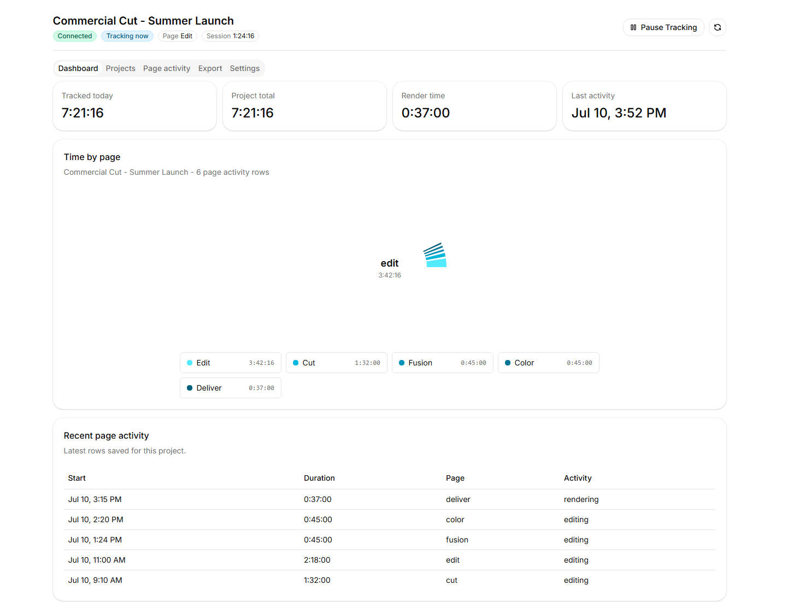
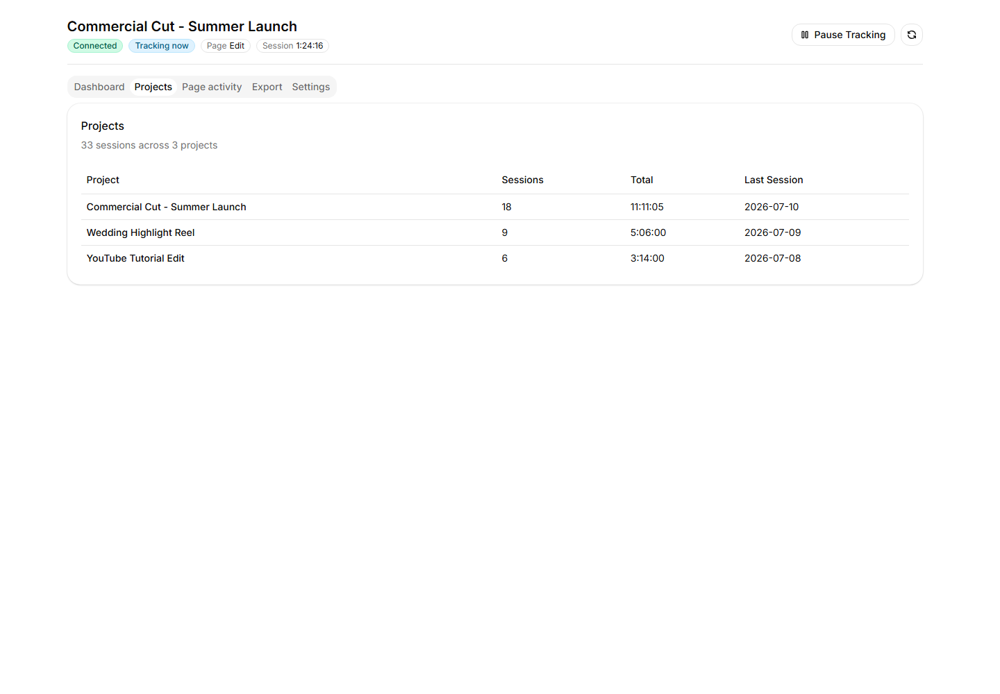
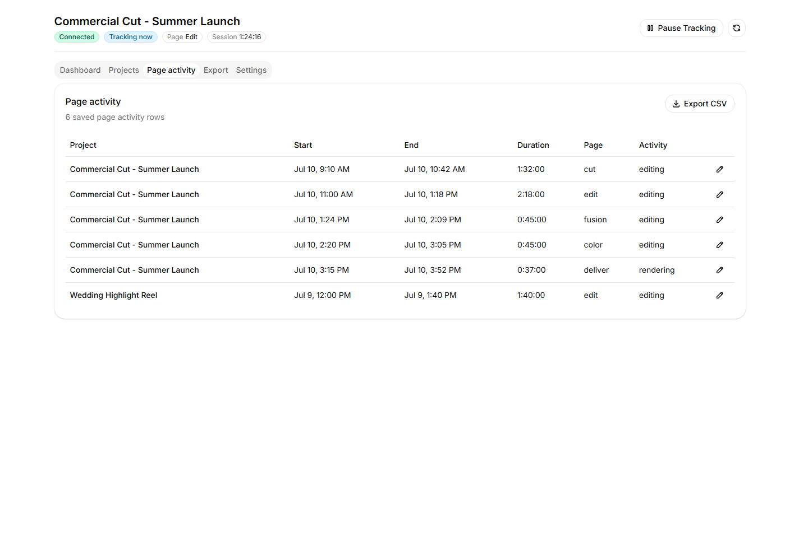
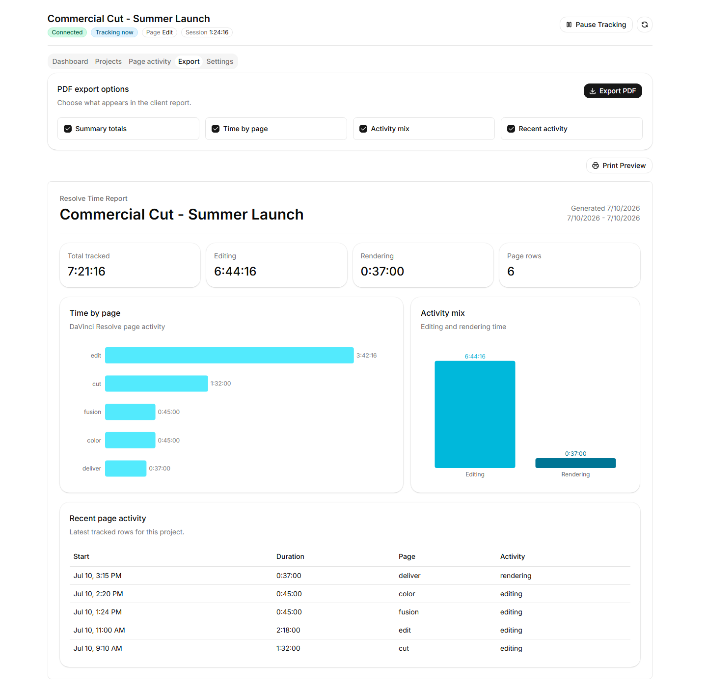
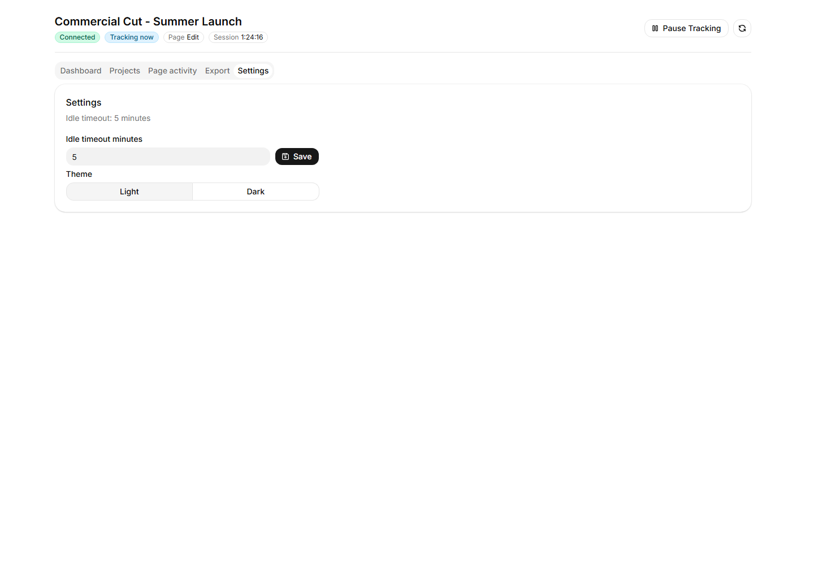
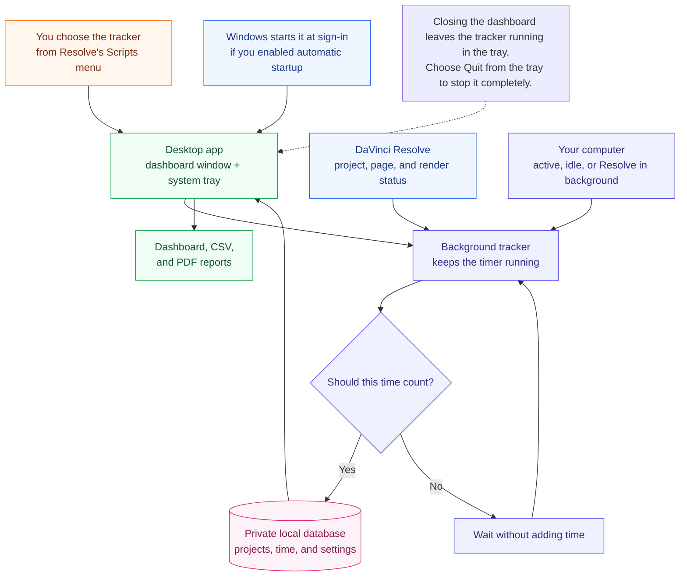
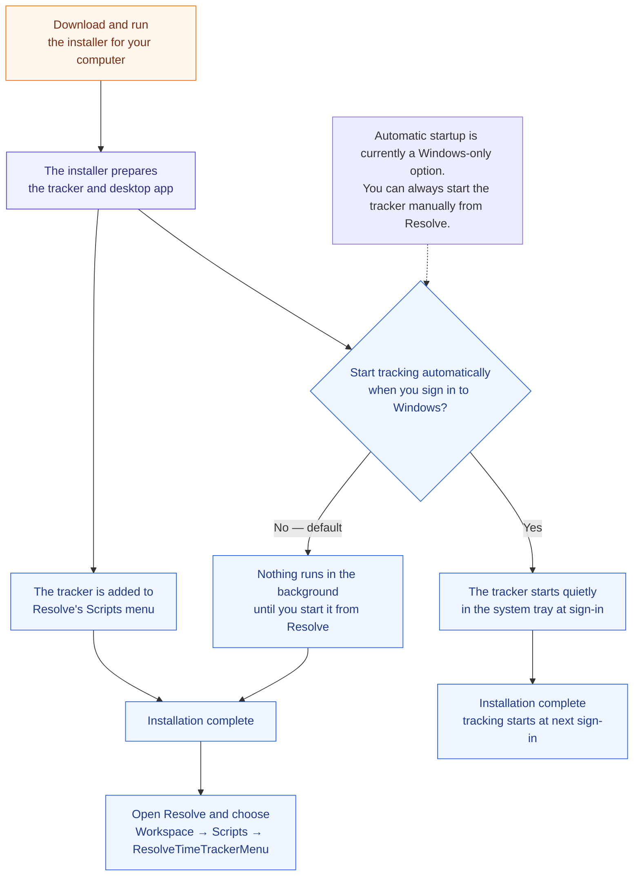

# Resolve Time Tracker

> **Work in progress:** Resolve Time Tracker is working, but it is still evolving. Clone it, fork it, modify it for your own DaVinci Resolve workflow, and open pull requests if you build something useful.

[](https://www.blackmagicdesign.com/products/davinciresolve)
[](https://www.python.org/)
[](https://fastapi.tiangolo.com/)
[](https://www.electronjs.org/)
[](https://react.dev/)
[](https://ui.shadcn.com/)
[](https://www.sqlite.org/)
[](LICENSE)

Resolve Time Tracker is an MIT-licensed, open-source time tracker for DaVinci Resolve Studio. It tracks billable editing time per Resolve project while avoiding the classic mistake: counting time after the editor has walked away.

## Requirements

- DaVinci Resolve Studio. The latest Resolve Studio release is the actively tested target; Windows with Resolve Studio 21 is currently verified.
- Git, used to download and update the project.
- Node.js with npm, used to build the desktop app.

The installer supplies `uv`, Python 3.13, Python packages, and frontend packages. macOS and Linux support is available but still needs broader real-machine testing; see [Platform Support](#platform-support).

## Install

Resolve Time Tracker installs as a DaVinci Resolve Scripts-menu tool. After install, open Resolve and run:

```text
Workspace > Scripts > ResolveTimeTrackerMenu
```

| Platform | Download | Run |
| --- | --- | --- |
| Windows | [install.ps1](https://raw.githubusercontent.com/Today20092/Davinci-Resolve-TimeTracker/main/install.ps1) | Right-click the file and choose **Run with PowerShell**. |
| macOS | [install.sh](https://raw.githubusercontent.com/Today20092/Davinci-Resolve-TimeTracker/main/install.sh) | `sh ~/Downloads/install.sh` |
| Linux | [install.sh](https://raw.githubusercontent.com/Today20092/Davinci-Resolve-TimeTracker/main/install.sh) | `sh ~/Downloads/install.sh` |

Windows users who prefer a one-command install can run:

```powershell
irm https://raw.githubusercontent.com/Today20092/Davinci-Resolve-TimeTracker/main/install.ps1 | iex
```

This downloads and immediately runs the installer. Use the download link above instead if you want to inspect the script before running it.

If Windows blocks `install.ps1`, open PowerShell in your Downloads folder and run:

```powershell
powershell -ExecutionPolicy Bypass -File .\install.ps1
```

The installer downloads the project source, installs Python dependencies, builds the companion app, and adds the DaVinci Resolve menu script.
It asks whether tracking should stay manual or start automatically with your computer. Manual start is the default.

If Git or Node.js with npm is missing, the installer stops before changing the installation and explains what to install.

### What "Start automatically" means

This choice currently applies to Windows:

- **Yes:** the installer adds `ResolveTimeTrackerBackground.cmd` to your Windows Startup folder. Each time you sign in, Windows starts a hidden Python process that runs the tracker's local API and checks Resolve activity. The process stays in memory while you are signed in, including on days when you do not open Resolve. It should do little work when unused, but it does use some RAM. It does not open the Electron window automatically.
- **No (default):** the installer does not add anything to Windows Startup. No Resolve Time Tracker process runs after sign-in. Start it only when needed from `Workspace > Scripts > ResolveTimeTrackerMenu` in DaVinci Resolve.

Choosing Yes does not give the tracker control of your computer. It only starts the same local tracker automatically and keeps its API on `127.0.0.1` (your computer only). The tracker records project timing and activity state; it does not record keystrokes, mouse coordinates, screen contents, footage, or media contents.

For Linux activity detection, install `xprintidle` and `xdotool` with your distro package manager. Without them, the tracker can still run, but it falls back to always-active tracking.

### Update

Rerun the same installer you downloaded:

```powershell
.\install.ps1
```

```sh
sh install.sh
```

Restart Resolve if it was already open.

### Uninstall

Download and run the uninstaller for your platform:

| Platform | Download |
| --- | --- |
| Windows | [uninstall.ps1](https://raw.githubusercontent.com/Today20092/Davinci-Resolve-TimeTracker/main/uninstall.ps1) |
| macOS / Linux | [uninstall.sh](https://raw.githubusercontent.com/Today20092/Davinci-Resolve-TimeTracker/main/uninstall.sh) |

```powershell
.\uninstall.ps1
```

```sh
sh uninstall.sh
```

Quit Resolve Time Tracker from its tray menu first. The uninstaller shows every location it will remove and asks for confirmation. It separately asks whether to permanently delete `tracker.sqlite3`; choosing No preserves all tracked projects and time.

## Use

Open Resolve and run:

```text
Workspace > Scripts > ResolveTimeTrackerMenu
```

The companion window shows whether time is being recorded, the open Resolve project and page, saved work sessions, settings, and report exports. Use **Pause Tracking** to stop the timer manually and **Resume Tracking** to start it again.

If you opted into background startup during install, the tracker starts in the Windows system tray and records Resolve activity even when the companion window is closed. Green means time is actively being recorded, yellow means idle or paused, gray means Resolve is closed, and red means the tracker is disconnected.

CSV export writes closed sessions only. Open active sessions are exported after they close.

## Screenshots

These screenshots use sample project data to show the companion app pages.

### Dashboard



### Projects



### Page Activity



### Export



### Settings



## How Tracking Works

- Tracks while Resolve is the foreground app and you are not idle.
- Stops when Resolve is minimized or you switch to another app.
- Keeps tracking during Resolve render/export.
- Stores data locally in SQLite.
- Exports closed sessions to CSV.
- Never records keystrokes, mouse coordinates, screen contents, footage, or media contents.

Default data file:

```text
Windows: %LOCALAPPDATA%\ResolveTimeTracker\tracker.sqlite3
macOS: ~/Library/Application Support/ResolveTimeTracker/tracker.sqlite3
Linux: $XDG_DATA_HOME/ResolveTimeTracker/tracker.sqlite3 or ~/.local/share/ResolveTimeTracker/tracker.sqlite3
```

## Platform Support

- Windows: verified with DaVinci Resolve Studio 21.
- macOS: supported by installer and activity probes, needs real-machine smoke testing.
- Linux: supported by installer and Resolve scripting path; proper idle/focus detection requires `xprintidle` and `xdotool`.

More detail lives in [docs/platform-support.md](docs/platform-support.md).

## Need Help?

See [Troubleshooting](docs/troubleshooting.md) when the Resolve menu item is missing, the tracker is disconnected, or time is not increasing.

## Architecture

### Diagram Key

Both diagrams use the same visual language:

- **Orange:** where the user starts an action.
- **Blue:** DaVinci Resolve or an operating-system startup path.
- **Green:** the desktop app and results visible to the user.
- **Purple:** background work performed by the tracker.
- **Pink:** data stored privately on the computer.
- **Rectangle:** an action or part of the tracker; **diamond:** a choice; **cylinder:** stored data; **dotted line:** an explanatory note rather than a runtime step.

### Runtime Flow

How Resolve, the desktop companion, the local Python sidecar, and local storage talk to each other while the tracker is running.



### Install Flow

What the one-file installer prepares before the menu item appears inside DaVinci Resolve.



| Area | Files | Responsibility |
| --- | --- | --- |
| Plugin entry | `scripts/ResolveTimeTracker.py` | Launches Electron by default, or runs the FastAPI sidecar when Electron requests `--api`. |
| Install path | `install.py`, `install.ps1`, `install.sh`, `scripts/install_resolve_menu.py` | Prepares Python and frontend dependencies, then installs the Resolve Scripts-menu launcher. |
| Interface | `frontend/` | Electron owns the window, tray, sidecar lifecycle, and desktop PDF printing; React, Vite, Tailwind, and shadcn/ui render the dashboard. |
| Backend API | `src/resolve_time_tracker/api.py` | FastAPI exposes localhost commands, exports, server-sent invalidations, and the complete dashboard read model consumed by React. |
| Tracking rules | `src/resolve_time_tracker/tracking_engine.py` | Converts Resolve/runtime snapshots into billable Sessions with heartbeats. |
| Resolve adapter | `src/resolve_time_tracker/resolve_bridge.py` | Reads project, Page, render, timeline, idle, and foreground state. |
| Storage | `src/resolve_time_tracker/database.py` | Stores Projects, active Session, closed Sessions, settings, heartbeat recovery, summaries, and CSV output in SQLite. |

## Development and Contributing

Local checkouts also install `Workspace > Scripts > ResolveTimeTrackerDevMenu`.
It starts the Vite development server and Electron with hot reload; use the normal
`ResolveTimeTrackerMenu` entry for the built app.

The [Development Guide](docs/development.md) covers prerequisites, repository structure, local startup, API access, tests, linting, and builds. An AI coding agent can use the copyable [Agentic Development Prompt](docs/agentic-development-prompt.md) to prepare and verify a checkout. See [CONTRIBUTING.md](CONTRIBUTING.md) before opening a pull request.

## Credits

The project is inspired by Jamie Fenn's DaVinci Resolve time tracker concept and launch video:

- [I Built The Most POWERFUL Tool For Davinci Resolve](https://youtu.be/hPOm9HM6S_o)
- [Jamie Fenn Time Tracker](https://www.jamiefenn.com/p/time-tracker/)

This is an independent open-source implementation. It is not affiliated with, endorsed by, or a copy of Jamie Fenn's commercial product.

## License

MIT. See [LICENSE](LICENSE).
